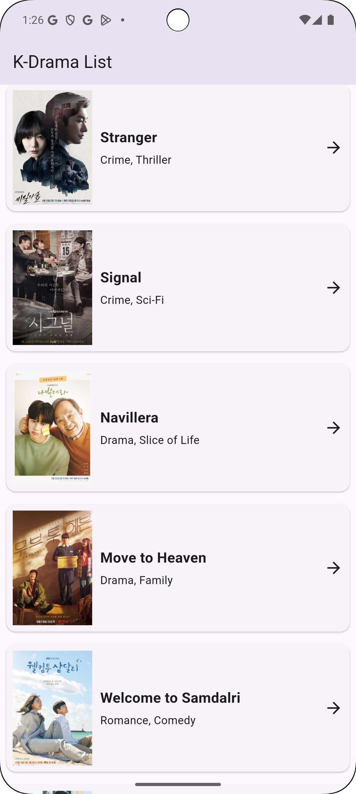

📱 Dynamic K-Drama List App

This is a Flutter application that displays a dynamic list of K-Dramas with images, descriptions, and navigation icons. The app presents a clean and visually appealing UI for K-Drama enthusiasts.

🎥 Demo
Check out the demo video on YouTube:
https://youtu.be/4GFiXoJYBgE

🚀 Features
Displays a list of 20 popular K-Dramas
Each item contains a title, genre, and poster image
Responsive and visually appealing UI
Smooth scrolling experience

📸 Screenshots

🛠 Installation
To run the app locally, follow these steps:

Clone the repository:
git clone https://github.com/your-repo/kdrama-list.git

Navigate to the project directory:
cd kdrama-list

Install dependencies:
flutter pub get

Run the app:
flutter run

Happy coding! 😊

